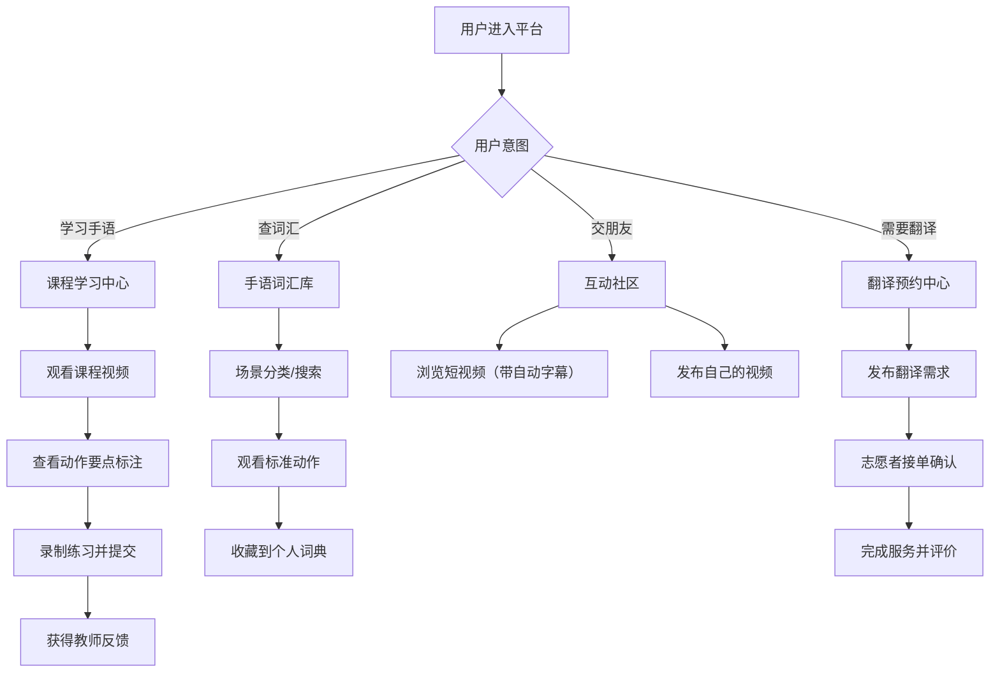

## 1. 产品概述

手语桥(SignBridge)是一款专为听障群体设计的手语学习与交流一站式平台，致力于打破听障人士与健听人群之间的沟通壁垒，通过视频课程、词汇库、社区互动和志愿者翻译服务四大核心模块，赋能听障群体自主学习手语、便捷获取翻译支持，并构建互助社群。

- 目标用户：听障人士、手语学习者、志愿者手语翻译、手语教师
- 核心价值：标准化手语学习资源、智能化对照纠正、无障碍交流社区、专业翻译志愿服务

## 2. 核心功能

### 2.1 用户角色

| 角色 | 注册方式 | 核心权限 |
|------|----------|----------|
| 学员/听障用户 | 手机号/邮箱注册 | 学习课程、练习提交、词汇搜索收藏、发布社区内容、预约翻译 |
| 手语教师 | 资质审核后注册 | 录制上传课程、标注动作要点、批改学员作业 |
| 志愿者翻译 | 资质审核后注册 | 接收翻译需求、确认接单、服务评价 |
| 平台管理员 | 后台账号 | 内容审核、用户管理、数据统计 |

### 2.2 功能模块

1. **首页/导航**：功能入口导航、学习进度概览、推荐课程与社区热帖
2. **课程学习中心**：课程列表、视频播放、动作要点标注、学员练习提交与反馈
3. **手语词汇库**：场景分类导航、词汇搜索、标准动作视频、个人收藏词典
4. **互动社区**：短视频发布、自动字幕生成、点赞评论关注、话题分类
5. **翻译预约中心**：需求发布、翻译接单、时间确认、服务评价
6. **进度追踪中心**：学习数据统计、练习记录、社区互动数据、成就徽章

### 2.3 页面详情

| 页面名称 | 模块名称 | 功能描述 |
|----------|----------|----------|
| 首页 | 顶部导航 | Logo、搜索框、消息通知、用户头像下拉菜单 |
| 首页 | 学习概览卡片 | 完成课程数、本周练习时长、连续学习天数、下一节待学课程 |
| 首页 | 课程推荐区 | 横向滚动推荐课程卡片（封面/标题/难度/进度） |
| 首页 | 热门词汇Top10 | 高频使用词汇快捷入口 |
| 首页 | 社区动态流 | 短视频瀑布流预览（自动字幕可见） |
| 首页 | 翻译服务入口 | 快速预约翻译按钮 + 近期服务状态 |
| 课程列表页 | 分类筛选 | 难度等级（入门/初级/中级/高级）、课程类型、时长筛选 |
| 课程列表页 | 课程卡片网格 | 封面图、标题、教师、课时数、评分、学员数 |
| 课程详情页 | 课程信息 | 标题、简介、目录大纲、教师介绍、评分评价 |
| 课程播放页 | 视频播放器 | 播放/暂停、倍速、全屏、手势动作时间轴标记 |
| 课程播放页 | 动作要点面板 | 关键手势动作图文标注（手型/位置/运动轨迹） |
| 课程播放页 | 练习录制区 | 摄像头调用、录制上传、与标准动作同屏对照 |
| 课程播放页 | 教师反馈区 | 批改评语、改进建议、通过/待改进状态 |
| 词汇库首页 | 场景分类树 | 日常生活/医疗就诊/职场沟通/教育学习/法律事务 |
| 词汇库首页 | 搜索栏 | 关键词搜索、拼音搜索、手势描述搜索 |
| 词汇详情页 | 标准动作视频 | 多角度视频展示、慢速播放、循环播放 |
| 词汇详情页 | 动作分解 | 分步动作图解+文字说明 |
| 词汇详情页 | 收藏/取消收藏 | 加入个人手语词典 |
| 个人词典页 | 收藏分组 | 自定义分组管理、最近使用、按字母/场景排序 |
| 社区首页 | 频道Tab | 推荐/关注/附近/话题分类 |
| 社区首页 | 短视频瀑布流 | 视频缩略图、自动字幕预览、发布者信息、互动数 |
| 视频播放页 | 视频层 | 竖屏播放、自动字幕叠加 |
| 视频播放页 | 互动区 | 点赞/评论/转发/收藏、评论列表（文字+表情包） |
| 视频发布页 | 拍摄上传 | 摄像头拍摄/本地上传、自动字幕识别与编辑、话题标签 |
| 翻译需求列表 | 需求卡片 | 场景类型、时间、地点、预算（如有）、发布时间 |
| 发布需求页 | 需求表单 | 场景选择、日期时间、线上/线下、详细描述、紧急程度 |
| 翻译预约详情 | 订单状态 | 待接单/已确认/进行中/已完成/已评价 |
| 翻译预约详情 | 沟通面板 | 文字消息沟通、时间调整确认 |
| 进度中心 | 数据看板 | 总学习时长、完成课程数、完成练习数、词汇掌握数 |
| 进度中心 | 学习图表 | 周/月学习趋势柱状图、场景词汇掌握雷达图 |
| 进度中心 | 成就徽章墙 | 已获得徽章、待解锁徽章进度 |
| 个人中心 | 资料编辑 | 头像、昵称、简介、听障身份标识、学习目标 |
| 个人中心 | 功能菜单 | 我的课程/我的词典/我的发布/我的预约/设置 |

## 3. 核心流程

### 3.1 课程学习流程
用户浏览课程列表 → 选择感兴趣的课程 → 观看教师视频（含动作要点标注）→ 开启摄像头跟练并录制 → 提交练习视频 → 教师/AI标注反馈 → 用户查看改进建议 → 通过后进入下一课时

### 3.2 词汇查询与收藏流程
用户进入词汇库 → 按场景浏览或关键词搜索 → 找到目标词汇 → 观看标准动作视频（可慢速/循环）→ 查看动作分解说明 → 点击收藏加入个人词典 → 在个人词典中分组管理快速查阅

### 3.3 翻译预约流程
听障用户发布翻译需求（场景/时间/地点）→ 志愿者翻译浏览需求列表 → 选择合适需求接单 → 双方确认时间细节 → 服务当天线上/线下进行 → 完成后双方互评 → 服务记录归档

### 3.4 社区交流流程
用户拍摄或上传短视频 → 系统自动生成字幕 → 用户编辑校对字幕并添加话题标签 → 发布到社区 → 其他用户浏览观看（自动显示字幕）→ 点赞评论互动 → 关注感兴趣的创作者

## 4. 用户界面设计

### 4.1 设计风格

- **主色调**：深海蓝 #1E3A5F（稳重、信任、无障碍友好）
- **辅助色**：活力橙 #FF6B35（强调CTA按钮、重要提醒）、薄荷绿 #4ECDC4（成功状态、进展良好）、柔和黄 #FFE66D（提示信息、成就高亮）
- **中性色**：近黑 #1A1A2E（文字主色）、深灰 #4A4A68（次要文字）、浅灰 #F5F5F7（背景卡片）、纯白 #FFFFFF
- **按钮风格**：大圆角（12px）、微阴影、悬停上浮效果；主按钮实色填充，次要按钮描边透明底
- **字体方案**：主字体 Noto Sans SC（对简体中文支持优秀且字形清晰易读），辅助字体 Sarasa Mono SC（用于标注说明）；标题 24-32px 粗体，正文 14-16px 常规，辅助文字 12px
- **布局风格**：卡片式布局、充足留白（8px基础间距单位）、清晰的视觉层级、强对比度（符合WCAG AA级无障碍标准）
- **图标风格**：线性描边图标（2px线宽）、圆角末端、配合emoji增加情感化表达

### 4.2 页面设计概览

| 页面名称 | 模块名称 | UI元素 |
|----------|----------|--------|
| 首页 | 学习概览卡片 | 渐变背景卡片 + 数据大字 + 迷你趋势图；橙色CTA按钮"继续学习" |
| 首页 | 课程推荐区 | 横向滚动卡片，封面图叠加难度标签和进度条；悬停放大效果 |
| 课程播放页 | 视频播放器 | 左侧大视频区 + 右侧动作要点面板（时间点联动高亮） |
| 课程播放页 | 练习录制区 | 视频下方展开式面板：左侧标准动作小窗 + 右侧摄像头实时画面 |
| 词汇库首页 | 场景分类区 | 彩色图标大卡片网格（5大场景各配插画图标），点击展开子分类 |
| 词汇详情页 | 动作分解区 | 分步卡片横向排列：步骤编号圆圈 + 动作图解 + 文字说明 |
| 社区首页 | 短视频瀑布流 | 双列瀑布流，每个视频卡片底部叠加2行自动字幕文字 |
| 视频播放页 | 视频层 | 竖屏视频居中，底部半透明黑条叠加白色自动字幕 |
| 翻译需求列表 | 需求卡片 | 左侧场景彩色icon + 中间核心信息 + 右侧状态标签和"接单/查看"按钮 |
| 进度中心 | 数据看板 | 顶部4个统计卡片 + 中部双图表布局（趋势图+雷达图）+ 底部徽章墙 |

### 4.3 响应式设计

- **设计原则**：桌面端优先（1440px基准），自适应平板（768px）和移动端（375px）
- **桌面端**：侧边导航栏 + 主内容区双栏布局，课程播放页三栏布局（视频+要点+目录）
- **平板端**：顶部导航汉堡菜单，内容区单栏或双列，视频播放区上下布局
- **移动端**：底部Tab导航（首页/课程/词汇/社区/我的），单列流式布局，视频竖屏优化
- **触控优化**：所有可点击元素最小尺寸44x44px，重要CTA按钮≥48px高度；滑动手势支持（返回、切换Tab、下拉刷新）
- **无障碍支持**：所有图片/图标含alt文本；支持键盘Tab导航；支持屏幕阅读器；色彩对比度≥4.5:1；字幕文字可调节大小

### 4.4 动效与交互

- **页面加载**：顶部进度条 + 内容区域渐入向上（stagger延迟50ms）
- **卡片悬停**：y轴上浮-4px + 阴影加深 + 边缘微发光（主色调）
- **按钮点击**：缩放0.96 + 背景色加深，回弹动画200ms ease-out
- **视频时间轴**：关键手势点标记为橙色小圆点，悬停显示动作名称tooltip
- **练习录制**：倒计时3-2-1圆环动画，录制中红色呼吸指示灯
- **字幕动画**：逐词淡入高亮，当前词放大110%并显示下划线
- **徽章解锁**：中心弹窗光效爆发 + 徽章旋转落地 + confetti粒子效果
- **页面转场**：新内容从右滑入，旧内容左移淡出（250ms cubic-bezier）
