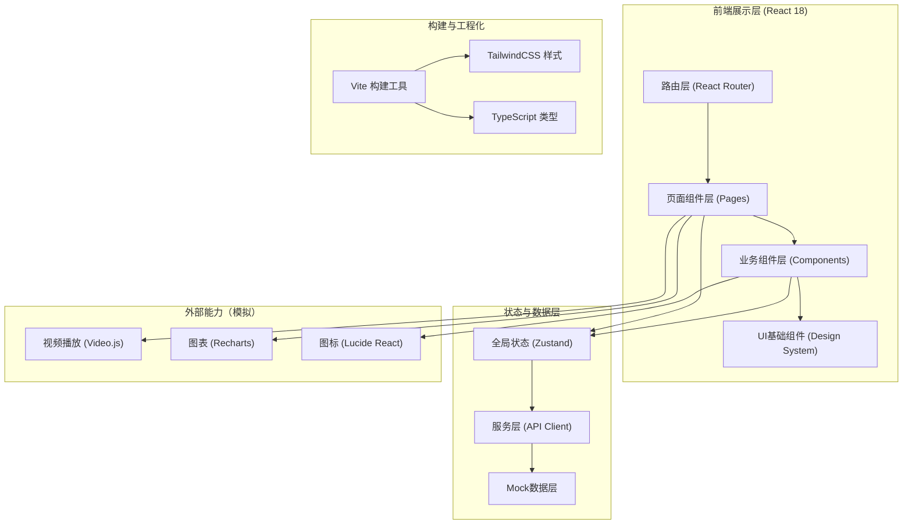
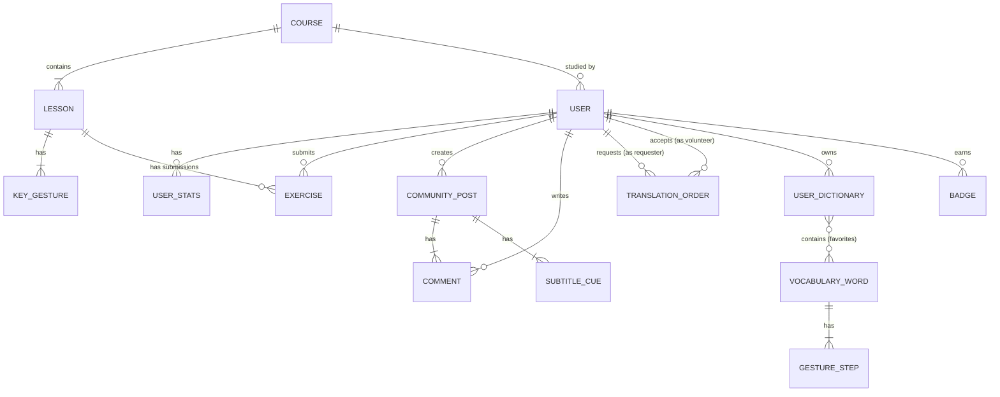

## 1. 架构设计



## 2. 技术描述

- **前端框架**：React 18 + TypeScript 5（类型安全的函数式组件 + Hooks）
- **构建工具**：Vite 5（快速启动、热更新、Tree Shaking优化）
- **样式方案**：TailwindCSS 3（原子化CSS + 自定义Design Token）+ CSS Variables（主题切换）
- **路由管理**：React Router v6（嵌套路由、懒加载、导航守卫）
- **状态管理**：Zustand 4（轻量全局状态，按领域拆分Store：user/course/vocab/community/translate）
- **数据请求**：Axios + 自定义拦截器（统一Mock处理、错误提示、Loading态）
- **UI组件库**：自设计系统（基于TailwindCSS封装）+ lucide-react（线性图标）
- **视频播放**：Video.js（自定义皮肤、关键帧标记、字幕叠加）
- **图表可视化**：Recharts（学习趋势图、雷达图，SVG矢量高性能）
- **视频录制**：MediaRecorder API（浏览器原生，无需额外依赖）
- **字幕模拟**：前端定时渲染（模拟ASR自动生成效果）
- **后端/数据库**：无后端，采用Mock数据层（TypeScript类型定义 + JSON数据 + localStorage持久化）

## 3. 路由定义

| 路由路径 | 页面名称 | 说明 |
|----------|----------|------|
| `/` | 首页（学习概览） | 默认路由，展示学习进度、推荐内容、功能入口 |
| `/courses` | 课程列表页 | 课程分类筛选、课程卡片网格 |
| `/courses/:id` | 课程详情页 | 课程介绍、目录大纲、报名入口 |
| `/courses/:id/learn/:lessonId` | 课程播放页 | 视频学习、动作要点、练习录制 |
| `/vocabulary` | 词汇库首页 | 场景分类、搜索栏、热门词汇 |
| `/vocabulary/:wordId` | 词汇详情页 | 标准动作、动作分解、收藏按钮 |
| `/vocabulary/my-dictionary` | 个人词典页 | 收藏分组管理、快速查阅 |
| `/community` | 社区首页 | 频道Tab、短视频瀑布流 |
| `/community/post/:postId` | 视频播放页 | 竖屏视频、自动字幕、互动区 |
| `/community/create` | 视频发布页 | 拍摄上传、字幕编辑、话题标签 |
| `/translate` | 翻译需求列表 | 需求卡片、筛选条件、发布入口 |
| `/translate/create` | 发布需求页 | 需求表单、场景选择 |
| `/translate/:orderId` | 预约详情页 | 订单状态、沟通面板 |
| `/progress` | 进度中心 | 数据看板、学习图表、徽章墙 |
| `/profile` | 个人中心 | 个人资料、功能菜单入口 |
| `*` | 404页面 | 路由不存在时的友好提示页 |

## 4. API 定义（Mock层类型）

```typescript
// ============== 用户相关 ==============
interface User {
  id: string;
  nickname: string;
  avatar: string;
  role: 'student' | 'teacher' | 'volunteer' | 'admin';
  bio?: string;
  hearingImpaired: boolean;
  learningGoal?: string;
  createdAt: string;
}

interface UserStats {
  userId: string;
  totalStudyMinutes: number;
  completedCourses: number;
  completedExercises: number;
  masteredWords: number;
  streakDays: number;
  communityPosts: number;
  communityLikes: number;
}

// ============== 课程相关 ==============
interface Course {
  id: string;
  title: string;
  coverImage: string;
  description: string;
  level: 'beginner' | 'elementary' | 'intermediate' | 'advanced';
  teacherId: string;
  teacherName: string;
  teacherAvatar: string;
  lessonCount: number;
  totalMinutes: number;
  studentCount: number;
  rating: number;
  category: string;
  tags: string[];
  progress?: number; // 当前用户学习进度 0-100
}

interface Lesson {
  id: string;
  courseId: string;
  title: string;
  videoUrl: string;
  durationSeconds: number;
  order: number;
  keyGestures: KeyGesture[];
}

interface KeyGesture {
  id: string;
  lessonId: string;
  timestamp: number; // 视频内时间点（秒）
  name: string;
  description: string;
  handShape: string;
  position: string;
  movement: string;
  imageUrl?: string;
}

interface Exercise {
  id: string;
  lessonId: string;
  userId: string;
  videoUrl: string;
  submittedAt: string;
  status: 'pending' | 'approved' | 'needs_revision';
  feedback?: string;
  gradedBy?: string;
  gradedAt?: string;
}

// ============== 词汇相关 ==============
interface VocabularyWord {
  id: string;
  word: string;
  pinyin: string;
  category: string; // 场景分类
  subCategory?: string;
  videoUrl: string;
  imageUrl: string;
  steps: GestureStep[];
  usageExample: string;
  relatedWords: string[];
  searchCount: number;
}

interface GestureStep {
  step: number;
  description: string;
  imageUrl: string;
  tip?: string;
}

interface UserDictionary {
  userId: string;
  wordIds: string[];
  groups: DictionaryGroup[];
}

interface DictionaryGroup {
  id: string;
  name: string;
  wordIds: string[];
  color: string;
}

// ============== 社区相关 ==============
interface CommunityPost {
  id: string;
  userId: string;
  userName: string;
  userAvatar: string;
  videoUrl: string;
  coverImage: string;
  caption: string;
  subtitles: SubtitleCue[]; // 自动字幕
  tags: string[];
  likes: number;
  comments: number;
  shares: number;
  createdAt: string;
  isLiked?: boolean;
}

interface SubtitleCue {
  startTime: number;
  endTime: number;
  text: string;
}

interface Comment {
  id: string;
  postId: string;
  userId: string;
  userName: string;
  userAvatar: string;
  content: string;
  createdAt: string;
  likes: number;
}

// ============== 翻译预约相关 ==============
interface TranslationOrder {
  id: string;
  requesterId: string;
  requesterName: string;
  volunteerId?: string;
  volunteerName?: string;
  volunteerAvatar?: string;
  scene: 'medical' | 'court' | 'education' | 'business' | 'other';
  sceneText: string;
  date: string;
  startTime: string;
  endTime: string;
  isOnline: boolean;
  location?: string;
  meetingUrl?: string;
  description: string;
  urgency: 'normal' | 'urgent' | 'emergency';
  status: 'pending' | 'confirmed' | 'in_progress' | 'completed' | 'cancelled';
  rating?: number;
  review?: string;
  createdAt: string;
}

// ============== 徽章相关 ==============
interface Badge {
  id: string;
  name: string;
  description: string;
  icon: string;
  color: string;
  unlockedAt?: string;
  progress?: number;
  progressText?: string;
}

// ============== API Mock Service 接口 ==============
interface ApiResponse<T> {
  code: number;
  message: string;
  data: T;
}

declare const api: {
  // 用户
  getUser: () => Promise<ApiResponse<User>>;
  getUserStats: () => Promise<ApiResponse<UserStats>>;
  
  // 课程
  getCourses: (params?: { level?: string; category?: string }) => Promise<ApiResponse<Course[]>>;
  getCourse: (id: string) => Promise<ApiResponse<Course & { lessons: Lesson[] }>>;
  getLesson: (id: string) => Promise<ApiResponse<Lesson>>;
  submitExercise: (data: Omit<Exercise, 'id' | 'submittedAt' | 'status'>) => Promise<ApiResponse<Exercise>>;
  
  // 词汇
  getVocabulary: (params?: { category?: string; keyword?: string }) => Promise<ApiResponse<VocabularyWord[]>>;
  getWord: (id: string) => Promise<ApiResponse<VocabularyWord>>;
  toggleFavorite: (wordId: string) => Promise<ApiResponse<{ favorited: boolean }>>;
  getDictionary: () => Promise<ApiResponse<UserDictionary>>;
  
  // 社区
  getPosts: (params?: { channel?: string }) => Promise<ApiResponse<CommunityPost[]>>;
  getPost: (id: string) => Promise<ApiResponse<CommunityPost & { comments: Comment[] }>>;
  toggleLike: (postId: string) => Promise<ApiResponse<{ liked: boolean; count: number }>>;
  
  // 翻译
  getOrders: (params?: { status?: string; role?: string }) => Promise<ApiResponse<TranslationOrder[]>>;
  createOrder: (data: Omit<TranslationOrder, 'id' | 'status' | 'createdAt'>) => Promise<ApiResponse<TranslationOrder>>;
  acceptOrder: (orderId: string) => Promise<ApiResponse<TranslationOrder>>;
  completeOrder: (orderId: string, rating: number, review: string) => Promise<ApiResponse<TranslationOrder>>;
  
  // 进度
  getBadges: () => Promise<ApiResponse<Badge[]>>;
  getWeeklyTrend: () => Promise<ApiResponse<{ date: string; minutes: number }[]>>;
  getCategoryRadar: () => Promise<ApiResponse<{ category: string; percent: number }[]>>;
};
```

## 5. 数据模型（Mock数据结构）

### 5.1 数据模型关系



### 5.2 Mock数据初始化说明

| 数据模型 | 初始数据量 | 数据说明 |
|----------|------------|----------|
| User | 1 | 当前登录的模拟用户（听障学员身份） |
| Course | 8 | 覆盖入门/初级/中级，含日常生活/医疗/职场分类 |
| Lesson | 24 | 每课程3课时，每课时3-5个关键手势 |
| KeyGesture | 80+ | 每个关键手势含时间点、手型、位置、运动描述 |
| VocabularyWord | 120+ | 5大场景各20+词汇，含动作分解步骤 |
| CommunityPost | 15 | 模拟社区内容，含自动字幕时间轴 |
| Comment | 30+ | 每个帖子2-3条评论 |
| TranslationOrder | 6 | 不同状态的预约订单示例 |
| Badge | 12 | 学习成就徽章，含已获得和未解锁进度 |

### 5.3 localStorage 持久化键

| Key名 | 存储内容 |
|-------|----------|
| `signbridge_user` | 用户信息（模拟登录态） |
| `signbridge_dictionary` | 个人词典收藏与分组 |
| `signbridge_progress` | 课程学习进度（已完成课时ID） |
| `signbridge_likes` | 已点赞的帖子ID列表 |
| `signbridge_draft_orders` | 草稿箱中的翻译需求 |
